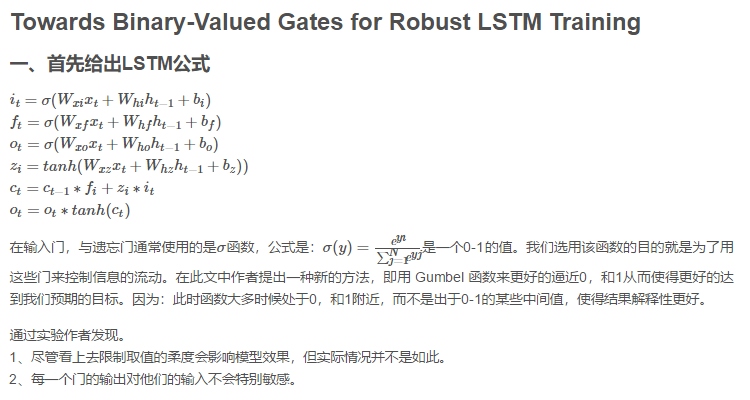
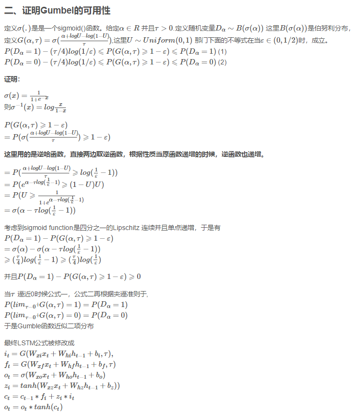

论文：Towards Binary-Valued Gates for Robust LSTM Training
 
博客：https://blog.csdn.net/zhoukaiyin_hzau/article/details/82347700
 
代码参考：https://github.com/zhuohan123/g2-lstm/blob/master/language-modeling/g2_lstm.py
